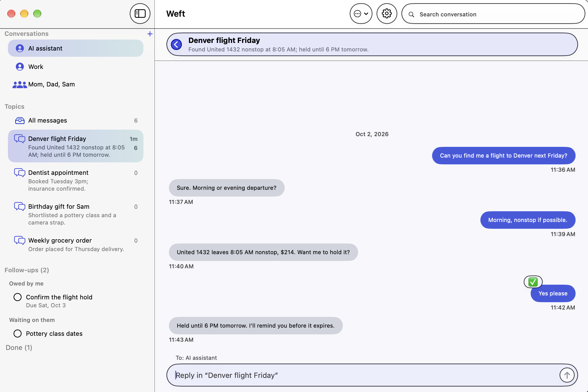
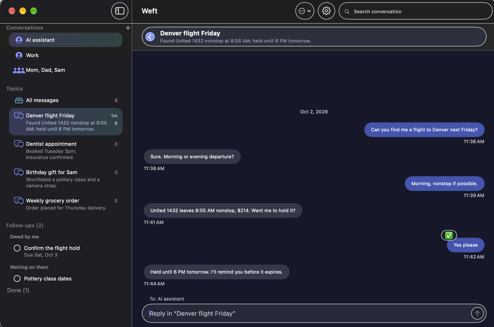

# Weft

**Turn endless Messages conversations into topic threads.**

If you text an AI assistant (or your boss, or the family group) about everything in one long conversation, it turns into a scroll of mixed subjects: travel plans, a bill, a recipe, back to the travel plans. Weft reads your conversations on your Mac and sorts each one into threads you can open, read and reply in, like separate email threads.



- **Threads, sorted automatically.** New messages are filed into the right thread a few seconds after they arrive, or a new thread is started. When a conversation comes back to an earlier subject, it lands in that same thread.
- **Your whole history.** After the first sort, Weft keeps sorting the older part of a long conversation in the background (you can turn this off in Settings).
- **Several conversations.** Add as many as you like with **+**, drag them into your own order, and right-click to remove one. All of them stay sorted in the background; a dot shows which have new messages.
- **Group chats.** Each message shows who sent it, and the sorting knows who said what. Replies go to the whole group — including groups with Android members, sent as regular texts through your iPhone (turn on Text Message Forwarding).
- **Reply inside a thread.** Your reply is sent through Messages as you. It starts with "Re: <thread> —", so the other side knows which subject you mean (you can turn this off).
- **Open loops.** Weft keeps a list of requests that haven't been answered yet and promises that haven't been kept, and checks them off when they're done.
- **Search** across the whole conversation.
- **Reactions** (❤️ 👍 ✅ …) show on messages just like in Messages, including several people's in a group — click them to see who reacted.
- **Contact names** next to phone numbers, if you allow Contacts access.
- **Notifications.** A red count on Weft's Dock icon and next to each conversation, plus optional notifications with a sound you pick. Clicking one opens that conversation.
- **Automatic updates.** Weft checks for new versions and offers to install them (Weft → Check for Updates…).
- **Light, Dark or Automatic** appearance (Settings → Appearance).

Weft never changes your Messages history. It only reads it, and sends a message when you press Send.

## Requirements

- A Mac running **macOS 15 (Sequoia) or later**, Apple Silicon or Intel.
- **Messages set up on that Mac.** For regular texts (green bubbles) to appear, turn on *Text Message Forwarding* on your iPhone: Settings → Apps → Messages → Text Message Forwarding.
- **An AI to do the sorting.** Use one you already pay for, or a free one that runs on your Mac (see below).

## Install

1. Download the latest **Weft-x.y.z.dmg** from [Releases](../../releases) and open it.
2. In the window that appears, drag **Weft** onto the **Applications** folder.
3. Open Weft and grant **Full Disk Access** when it asks: System Settings → Privacy & Security → Full Disk Access → turn on Weft. Messages stores its history in a protected folder, so macOS requires this before Weft can read it.
4. Pick a conversation to sort. Add more any time with the **+** next to **Conversations**.
5. Open **Settings** (gear icon, or Weft → Settings…) and choose the AI under **Sorting**. Click **Test** to make sure it works.



The first time you send a reply from Weft, macOS asks whether Weft may control Messages. Click **Allow**.

## Choosing an AI

Weft uses an AI you already have. **It never asks for an API key**: the subscription options use the command-line tool each company makes, signed in with your normal account.

| Option | What you need | Where your messages go |
|---|---|---|
| **Claude** | A Claude subscription + [Claude Code](https://claude.com/claude-code), signed in | Anthropic |
| **ChatGPT** | A ChatGPT subscription + the [Codex CLI](https://github.com/openai/codex), signed in (`codex login`) | OpenAI |
| **Gemini** | A Google account + the [Gemini CLI](https://github.com/google-gemini/gemini-cli), signed in | Google |
| **Grok** | A Grok subscription + the Grok CLI, signed in (`grok login`) | xAI |
| **Ollama** | Nothing to pay for: install [Ollama](https://ollama.com/download) and Weft downloads a model for you | Stays on your Mac |
| **LM Studio** | Nothing to pay for: install [LM Studio](https://lmstudio.ai), load a model, start its server | Stays on your Mac |

Settings shows which of these are already on your Mac, and offers a **Model** menu for each with the recommended choice marked. If you use a local model and a better one suits your Mac, Weft offers to download it.

**No subscription?** Choose **Ollama (local)** in Settings. Install Ollama from the link Weft shows, come back, and click **Download** to get the recommended model (about 2.5–5 GB, depending on your Mac's memory). Local models are free and private, but they sort less well than the subscription AIs and can only look at a shorter stretch of the conversation at a time.

Sorting uses a small amount of your plan's usage each time new messages arrive. For a sense of scale, here is what the same work would cost at pay-as-you-go API prices (Weft itself never uses API keys — with a subscription it simply comes out of your plan's allowance):

| Work | Claude Sonnet 5.5 | Claude Haiku 4.5 | GPT-6 Luna |
|---|---|---|---|
| Filing one new message and its reply (~5,000 tokens) | ~1.4¢ | ~0.7¢ | ~0.07¢ |
| 100 messages and replies | ~$1.40 | ~70¢ | ~7¢ |
| First sort of a long conversation (~100,000 tokens, once) | ~25¢ | ~12¢ | ~1¢ |

Based on list prices per million tokens (input / output): Sonnet 5.5 $2 / $10, Haiku 4.5 $1 / $5, GPT-6 Luna $0.10 / $0.50. Prices change; check each provider for current rates. Check your provider's terms for how they allow their command-line tools to be used.

## Privacy

- Weft reads your Messages history **only on your Mac** and never changes it.
- To sort, Weft sends the text of the conversations you added (and who sent each message) to the AI you chose, and nothing else. Each added conversation uses a little of your AI plan as new messages arrive. With Ollama or LM Studio, nothing leaves your Mac.
- Weft has no account, no server, no analytics and no tracking. Topics and open loops are saved in `~/Library/Application Support/Weft/`.
- At launch Weft contacts GitHub to check for updates and to read its model recommendations (`recommendations.json` in this project). GitHub sees your internet address; no messages or personal data are sent.
- Contacts access is optional. Weft shows names next to numbers, and the names are also part of the text sent to the AI you chose, so it knows who said what. Without Contacts access, phone numbers and email addresses are sent instead. With Ollama or LM Studio, nothing leaves your Mac.

## Limitations

- Mac only. iOS doesn't let apps read your messages, and Android only lets an app do so if it is your default texting app.
- Photos and attachments show as "[attachment]".

## Building from source

Requires the full **Xcode** app (the Command Line Tools alone can't build SwiftUI apps on recent macOS).

```sh
DEVELOPER_DIR=/Applications/Xcode.app/Contents/Developer ./make-app.sh
open .build-app/Weft.app
```

`release.sh` builds a signed, notarized download; see the comments at the top of that file.

## License

MIT. See [LICENSE](LICENSE).
